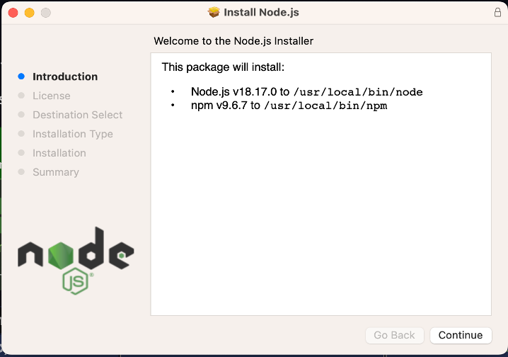
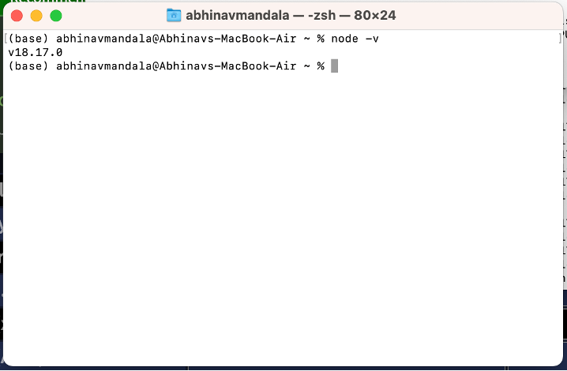
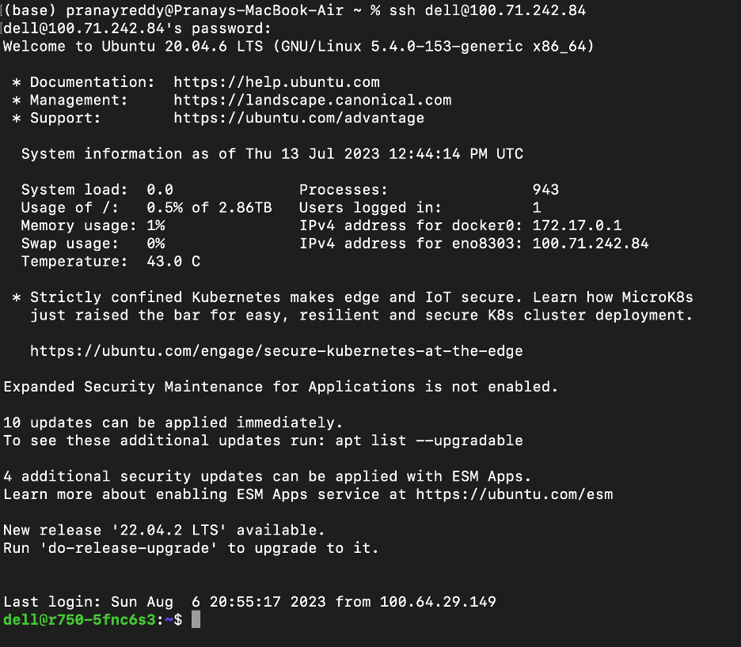
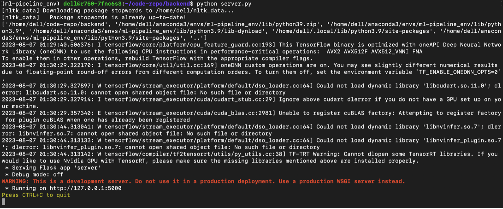

# Quick Guide to Run AI IntegAItor

## One-Time Setup:

### FRONTEND SETUP:

1. Download and Install Node.js:
   - Link to download: [Node.js Download](https://nodejs.org/en/download)
   - Download the appropriate version for your operating system.
     
   - After downloading, run the installer.
     
   - Verify the installation by opening a terminal and running the command: `node -v`.
     You should see the latest version of Node.js.
     

### BACKEND SETUP:

1. Quickly connect to the VPN using your Dell VPN credentials.
3. Once connected, you can proceed to the next steps.
4. Log in to the Dell worker node where the backend Python code is located:
      ```
      ssh dell@100.71.242.84
      ```
5. After a successful login, you should see the terminal.
    
7. Download the following tools to finish the setup:
      - Python 3.9
      - Node.js 18.15.0
      - Anaconda (latest version)
      - Docker Engine 23.0.5
      - MongoDB 6.0
      - Git
      - rsync
      - ssh
## Running the AI IntegAItor Application

### To Run the Application for the First Time

#### 1. Initialize Backend:

1. Log into Dell server and Create a folder named "shrec-demo" on the Dell server.
3. Navigate to the folder using the terminal: `cd shrec-demo/`
4. Clone the shrec repository code: `git clone git@github.com:abhinavmandala/shrec_hf_website.git`
5. Navigate to the backend folder: `cd shrec_hf_website/backend/`
6. Activate the conda virtual environment: `conda activate ml-pipeline_env`
7. Start the backend server: `python server.py`
8. With the backend server running, you can now make requests from the UI.
   

#### 2. Run GUI for the First Time:

1. Create a folder named "shrec-demo" on the client server.
2. Open a new terminal and navigate to the folder: `cd Desktop/shrec-demo/`
3. Clone the shrec repository code: `git clone git@github.com:abhinavmandala/shrec_hf_website.git`
4. Navigate to the cloned repository: `cd shrec_hf_website/`
5. Run the command to install dependencies: `npm install --force`
6. Start the GUI: `npm start`
7. Open the application in your browser: [http://localhost:3000/](http://localhost:3000/)

   

#### To Run the GUI Application Every Time:

1. Go to the project folder.
2. Run the command to start the GUI: `npm start`
3. Open the application in your browser: [http://localhost:3000/](http://localhost:3000/)

   


